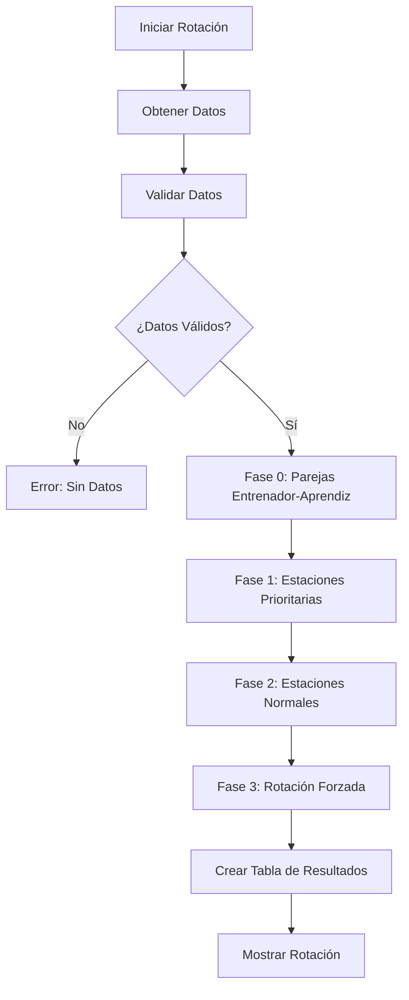
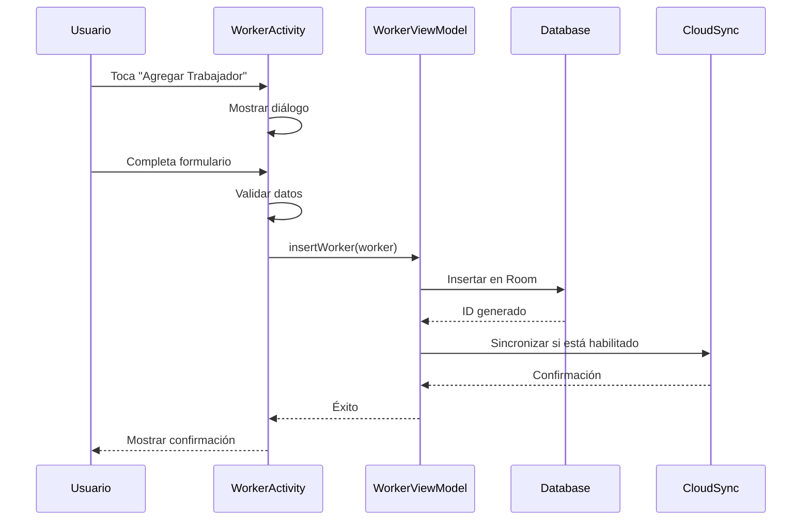
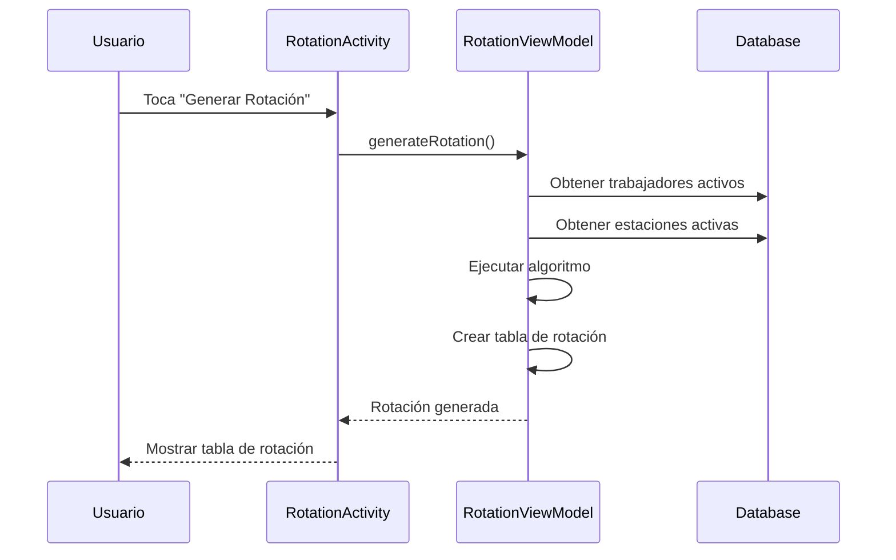
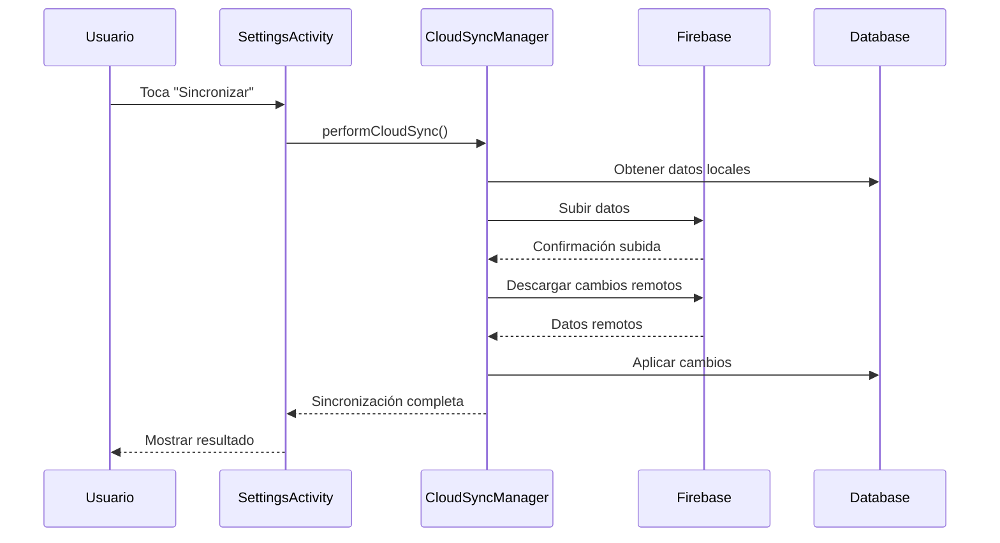

# 🔧 Documentación Técnica - Sistema de Rotación Inteligente

## 📋 **Información General**

- **Nombre**: Sistema de Rotación Inteligente
- **Versión**: 2.1.0
- **Plataforma**: Android (API 24+)
- **Lenguaje**: Kotlin
- **Arquitectura**: MVVM + Room + Firebase
- **Desarrollador**: Brandon Josué Hidalgo Paz

---

## 🏗️ **ARQUITECTURA DEL SISTEMA**

### Patrón Arquitectónico: MVVM
```
┌─────────────────┐    ┌─────────────────┐    ┌─────────────────┐
│      View       │◄──►│   ViewModel     │◄──►│     Model       │
│   (Activities)  │    │ (Business Logic)│    │ (Data Layer)    │
└─────────────────┘    └─────────────────┘    └─────────────────┘
```

### Componentes Principales

#### 📱 **Capa de Presentación (View)**
- `MainActivity.kt` - Pantalla principal con navegación
- `RotationActivity.kt` - Generación y visualización de rotaciones
- `WorkerActivity.kt` - Gestión de trabajadores
- `WorkstationActivity.kt` - Gestión de estaciones
- `SettingsActivity.kt` - Configuraciones y preferencias

#### 🧠 **Capa de Lógica (ViewModel)**
- `RotationViewModel.kt` - Algoritmo de rotación inteligente
- `WorkerViewModel.kt` - Lógica de gestión de trabajadores
- `WorkstationViewModel.kt` - Lógica de gestión de estaciones

#### 💾 **Capa de Datos (Model)**
- `AppDatabase.kt` - Base de datos Room
- `Worker.kt`, `Workstation.kt` - Entidades principales
- `WorkerDao.kt`, `WorkstationDao.kt` - Acceso a datos
- `BackupManager.kt` - Gestión de respaldos
- `CloudSyncManager.kt` - Sincronización en la nube

---

## 🗄️ **BASE DE DATOS**

### Esquema de Base de Datos (Room)

#### Tabla: `workers`
```sql
CREATE TABLE workers (
    id INTEGER PRIMARY KEY AUTOINCREMENT,
    name TEXT NOT NULL,
    email TEXT,
    availabilityPercentage INTEGER DEFAULT 100,
    restrictionNotes TEXT DEFAULT '',
    isTrainer BOOLEAN DEFAULT 0,
    isTrainee BOOLEAN DEFAULT 0,
    trainerId INTEGER,
    trainingWorkstationId INTEGER,
    isActive BOOLEAN DEFAULT 1,
    currentWorkstationId INTEGER,
    rotationsInCurrentStation INTEGER DEFAULT 0,
    lastRotationTimestamp INTEGER DEFAULT 0,
    FOREIGN KEY (trainerId) REFERENCES workers(id),
    FOREIGN KEY (trainingWorkstationId) REFERENCES workstations(id),
    FOREIGN KEY (currentWorkstationId) REFERENCES workstations(id)
);
```

#### Tabla: `workstations`
```sql
CREATE TABLE workstations (
    id INTEGER PRIMARY KEY AUTOINCREMENT,
    name TEXT NOT NULL,
    requiredWorkers INTEGER DEFAULT 1,
    isPriority BOOLEAN DEFAULT 0,
    isActive BOOLEAN DEFAULT 1
);
```

#### Tabla: `worker_workstations` (Relación N:M)
```sql
CREATE TABLE worker_workstations (
    workerId INTEGER NOT NULL,
    workstationId INTEGER NOT NULL,
    PRIMARY KEY (workerId, workstationId),
    FOREIGN KEY (workerId) REFERENCES workers(id) ON DELETE CASCADE,
    FOREIGN KEY (workstationId) REFERENCES workstations(id) ON DELETE CASCADE
);
```

### Índices para Optimización
```sql
CREATE INDEX idx_workers_active ON workers(isActive);
CREATE INDEX idx_workers_trainer ON workers(isTrainer);
CREATE INDEX idx_workers_trainee ON workers(isTrainee);
CREATE INDEX idx_workstations_active ON workstations(isActive);
CREATE INDEX idx_workstations_priority ON workstations(isPriority);
```

---

## 🤖 **ALGORITMO DE ROTACIÓN INTELIGENTE**

### Flujo del Algoritmo



### Jerarquía de Prioridades

1. **MÁXIMA PRIORIDAD**: Parejas entrenador-aprendiz en estaciones prioritarias
2. **ALTA PRIORIDAD**: Parejas entrenador-aprendiz en estaciones normales
3. **MEDIA-ALTA**: Trabajadores necesitando rotación forzada
4. **MEDIA**: Trabajadores individuales en estaciones prioritarias
5. **NORMAL**: Trabajadores individuales en estaciones normales

### Criterios de Asignación

#### Factores Considerados
- **Disponibilidad**: Porcentaje de disponibilidad del trabajador
- **Capacidades**: Estaciones donde puede trabajar
- **Restricciones**: Limitaciones médicas o de horario
- **Estado de Entrenamiento**: Entrenador, aprendiz o certificado
- **Historial de Rotación**: Tiempo en estación actual
- **Prioridad de Estación**: Crítica o normal

#### Algoritmo de Selección
```kotlin
fun selectWorkerForStation(
    availableWorkers: List<Worker>,
    station: Workstation,
    currentAssignments: Map<Long, List<Worker>>
): Worker? {
    return availableWorkers
        .filter { canWorkAtStation(it, station) }
        .filter { meetsAvailabilityRequirement(it) }
        .filter { !hasRestrictionsForStation(it, station) }
        .sortedWith(
            compareByDescending<Worker> { it.isTrainer }
                .thenByDescending { it.availabilityPercentage }
                .thenBy { it.rotationsInCurrentStation }
        )
        .firstOrNull()
}
```

---

## ☁️ **SISTEMA DE SINCRONIZACIÓN EN LA NUBE**

### Arquitectura Firebase

```
┌─────────────────┐    ┌─────────────────┐    ┌─────────────────┐
│   Android App   │◄──►│   Firebase      │◄──►│   Cloud         │
│                 │    │   Services      │    │   Storage       │
├─────────────────┤    ├─────────────────┤    ├─────────────────┤
│ CloudAuthManager│◄──►│ Authentication  │    │ User Data       │
│ CloudSyncManager│◄──►│ Firestore       │    │ Backups         │
│ CloudSyncWorker │◄──►│ Cloud Functions │    │ Sync Metadata   │
└─────────────────┘    └─────────────────┘    └─────────────────┘
```

### Estructura de Datos en Firestore

```
/users/{userId}/
  └── workspaces/
      └── default/
          ├── workers/
          │   └── {workerId}
          │       ├── id: Long
          │       ├── name: String
          │       ├── email: String
          │       ├── availabilityPercentage: Int
          │       ├── isTrainer: Boolean
          │       ├── isTrainee: Boolean
          │       ├── trainerId: Long?
          │       ├── trainingWorkstationId: Long?
          │       ├── isActive: Boolean
          │       ├── lastModified: Long
          │       └── version: Int
          ├── workstations/
          │   └── {workstationId}
          │       ├── id: Long
          │       ├── name: String
          │       ├── requiredWorkers: Int
          │       ├── isPriority: Boolean
          │       ├── isActive: Boolean
          │       ├── lastModified: Long
          │       └── version: Int
          └── worker_workstations/
              └── {workerId}_{workstationId}
                  ├── workerId: Long
                  ├── workstationId: Long
                  ├── lastModified: Long
                  └── version: Int

/backups/
  └── {backupId}
      ├── id: String
      ├── userId: String
      ├── timestamp: Long
      ├── deviceInfo: Map<String, String>
      ├── workers: List<CloudWorker>
      ├── workstations: List<CloudWorkstation>
      ├── workerWorkstations: List<CloudWorkerWorkstation>
      └── version: Int
```

### Reglas de Seguridad Firestore

```javascript
rules_version = '2';
service cloud.firestore {
  match /databases/{database}/documents {
    // Usuarios solo pueden acceder a sus propios datos
    match /users/{userId}/{document=**} {
      allow read, write: if request.auth != null && request.auth.uid == userId;
    }
    
    // Respaldos solo para usuarios autenticados
    match /backups/{backupId} {
      allow read, write: if request.auth != null && 
        request.auth.uid == resource.data.userId;
    }
    
    // Metadatos públicos de solo lectura
    match /metadata/{document} {
      allow read: if true;
      allow write: if false;
    }
  }
}
```

---

## 🔄 **FLUJOS DE TRABAJO PRINCIPALES**

### 1. Flujo de Creación de Trabajador



### 2. Flujo de Generación de Rotación



### 3. Flujo de Sincronización en la Nube



---

## 🧪 **TESTING Y CALIDAD**

### Estrategia de Testing

#### Unit Tests
- **ViewModels**: Lógica de negocio
- **Repositories**: Acceso a datos
- **Utils**: Funciones de utilidad
- **Algoritmos**: Lógica de rotación

#### Integration Tests
- **Database**: Operaciones Room
- **Network**: Sincronización Firebase
- **UI**: Flujos de usuario principales

#### UI Tests (Espresso)
- **Navegación**: Entre pantallas
- **Formularios**: Validación de entrada
- **Rotación**: Generación y visualización

### Métricas de Calidad

#### Cobertura de Código
- **Target**: >80% cobertura
- **Crítico**: >95% en algoritmo de rotación
- **Mínimo**: >60% en UI components

#### Performance
- **Tiempo de rotación**: <2 segundos para 50 trabajadores
- **Sincronización**: <5 segundos para datos típicos
- **Startup**: <3 segundos en dispositivos medios

---

## 🔧 **CONFIGURACIÓN DE DESARROLLO**

### Requisitos del Sistema

#### Software Necesario
- **Android Studio**: Arctic Fox o superior
- **JDK**: 11 o superior
- **Android SDK**: API 24-34
- **Gradle**: 8.0+
- **Kotlin**: 1.9.10+

#### Dependencias Principales
```gradle
// Core Android
implementation 'androidx.core:core-ktx:1.12.0'
implementation 'androidx.appcompat:appcompat:1.6.1'
implementation 'com.google.android.material:material:1.10.0'

// Architecture Components
implementation 'androidx.lifecycle:lifecycle-viewmodel-ktx:2.7.0'
implementation 'androidx.lifecycle:lifecycle-livedata-ktx:2.7.0'

// Database
implementation 'androidx.room:room-runtime:2.6.0'
implementation 'androidx.room:room-ktx:2.6.0'
kapt 'androidx.room:room-compiler:2.6.0'

// Firebase (Opcional)
implementation platform('com.google.firebase:firebase-bom:32.7.0')
implementation 'com.google.firebase:firebase-firestore-ktx'
implementation 'com.google.firebase:firebase-auth-ktx'

// Serialization
implementation 'org.jetbrains.kotlinx:kotlinx-serialization-json:1.6.0'

// Work Manager
implementation 'androidx.work:work-runtime-ktx:2.8.1'
```

### Configuración del Proyecto

#### 1. Clonar Repositorio
```bash
git clone https://github.com/brandonhidalgopa13-jpg/workstation-rotation-app.git
cd workstation-rotation-app
```

#### 2. Configurar Android SDK
```properties
# local.properties
sdk.dir=C\:\\Users\\[Usuario]\\AppData\\Local\\Android\\Sdk
```

#### 3. Configurar Firebase (Opcional)
```bash
# Descargar google-services.json desde Firebase Console
# Colocar en app/google-services.json
```

#### 4. Compilar
```bash
./gradlew assembleDebug
```

---

## 📊 **MONITOREO Y ANALYTICS**

### Métricas Clave

#### Uso de la Aplicación
- **Rotaciones generadas por día**
- **Número de trabajadores gestionados**
- **Frecuencia de uso por funcionalidad**
- **Tiempo promedio de sesión**

#### Performance
- **Tiempo de generación de rotación**
- **Uso de memoria**
- **Crashes y errores**
- **Tiempo de sincronización**

#### Engagement
- **Retención de usuarios**
- **Funcionalidades más utilizadas**
- **Patrones de uso**
- **Feedback de usuarios**

### Implementación de Analytics

```kotlin
// Firebase Analytics (Opcional)
class AnalyticsManager {
    fun trackRotationGenerated(workerCount: Int, stationCount: Int) {
        firebaseAnalytics.logEvent("rotation_generated") {
            param("worker_count", workerCount.toLong())
            param("station_count", stationCount.toLong())
        }
    }
    
    fun trackFeatureUsed(featureName: String) {
        firebaseAnalytics.logEvent("feature_used") {
            param("feature_name", featureName)
        }
    }
}
```

---

## 🔒 **SEGURIDAD Y PRIVACIDAD**

### Medidas de Seguridad

#### Datos Locales
- **Encriptación**: Base de datos Room encriptada
- **Validación**: Sanitización de entrada de usuario
- **Permisos**: Mínimos permisos necesarios

#### Datos en la Nube
- **Autenticación**: Firebase Auth con Google
- **Autorización**: Reglas Firestore granulares
- **Encriptación**: HTTPS/TLS automático
- **Aislamiento**: Datos por usuario

#### Privacidad
- **Datos Mínimos**: Solo información necesaria
- **Consentimiento**: Claro sobre uso de datos
- **Eliminación**: Opción de eliminar cuenta
- **Transparencia**: Políticas claras

### Cumplimiento

#### GDPR (Europa)
- **Derecho al olvido**: Eliminación de datos
- **Portabilidad**: Exportación de datos
- **Consentimiento**: Explícito y granular
- **Minimización**: Solo datos necesarios

#### Mejores Prácticas
- **Principio de menor privilegio**
- **Validación de entrada robusta**
- **Logging seguro sin datos sensibles**
- **Actualizaciones de seguridad regulares**

---

## 🚀 **DEPLOYMENT Y DISTRIBUCIÓN**

### Proceso de Build

#### Debug Build
```bash
./gradlew assembleDebug
```

#### Release Build
```bash
./gradlew assembleRelease
```

#### Signing Configuration
```gradle
android {
    signingConfigs {
        release {
            storeFile file('keystore.jks')
            storePassword 'store_password'
            keyAlias 'key_alias'
            keyPassword 'key_password'
        }
    }
}
```

### CI/CD Pipeline

#### GitHub Actions
```yaml
name: Build APK
on: [push, pull_request]
jobs:
  build:
    runs-on: ubuntu-latest
    steps:
    - uses: actions/checkout@v3
    - name: Setup JDK
      uses: actions/setup-java@v3
      with:
        java-version: '11'
    - name: Build APK
      run: ./gradlew assembleDebug
    - name: Upload APK
      uses: actions/upload-artifact@v3
      with:
        name: app-debug.apk
        path: app/build/outputs/apk/debug/app-debug.apk
```

### Distribución

#### Google Play Store
1. **Preparar Release**: Firmar APK/AAB
2. **Metadata**: Descripción, capturas, iconos
3. **Testing**: Internal/Alpha/Beta testing
4. **Publicación**: Release a producción

#### Distribución Interna
1. **APK Directo**: Para testing interno
2. **Firebase App Distribution**: Para equipos
3. **Enterprise**: MDM para empresas

---

## 📈 **ROADMAP Y FUTURAS MEJORAS**

### Versión 2.2.0 (Próxima)
- **Reportes avanzados** con gráficos
- **Notificaciones push** para recordatorios
- **Modo offline mejorado** con sincronización diferida
- **Exportación a Excel/PDF**

### Versión 2.3.0
- **Multi-empresa** con gestión de organizaciones
- **Roles y permisos** granulares
- **API REST** para integraciones
- **Dashboard web** complementario

### Versión 3.0.0
- **Inteligencia artificial** para optimización automática
- **Predicción de disponibilidad** basada en patrones
- **Integración con sistemas HR** existentes
- **Análisis predictivo** de rotaciones

---

## 📞 **SOPORTE TÉCNICO**

### Información de Contacto
- **Desarrollador**: Brandon Josué Hidalgo Paz
- **Email**: [Contacto del desarrollador]
- **GitHub**: https://github.com/brandonhidalgopa13-jpg/workstation-rotation-app

### Recursos de Desarrollo
- **Documentación**: Este archivo y archivos relacionados
- **Issues**: GitHub Issues para reportar bugs
- **Discussions**: GitHub Discussions para preguntas
- **Wiki**: Documentación adicional en GitHub Wiki

### Contribuciones
1. **Fork** el repositorio
2. **Crear branch** para tu feature
3. **Commit** cambios con mensajes descriptivos
4. **Push** a tu fork
5. **Crear Pull Request** con descripción detallada

---

*© 2024 - Sistema de Rotación Inteligente - Documentación Técnica v2.1.0*