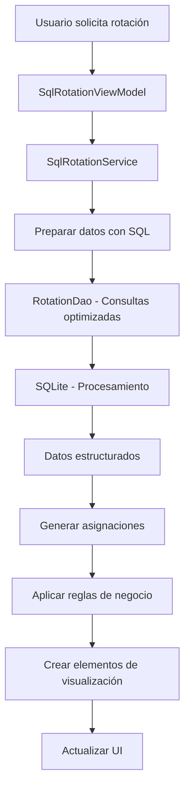
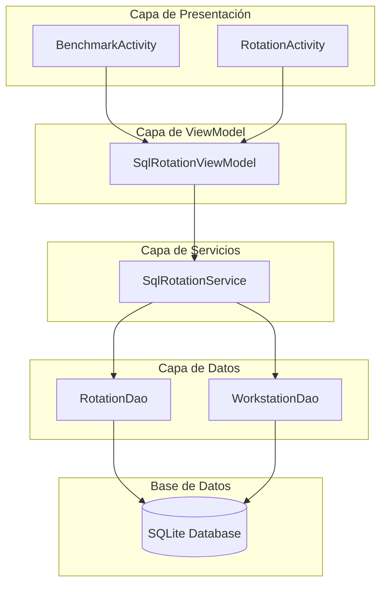
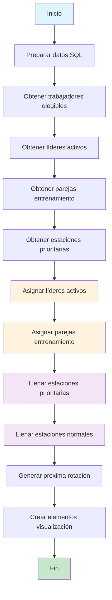
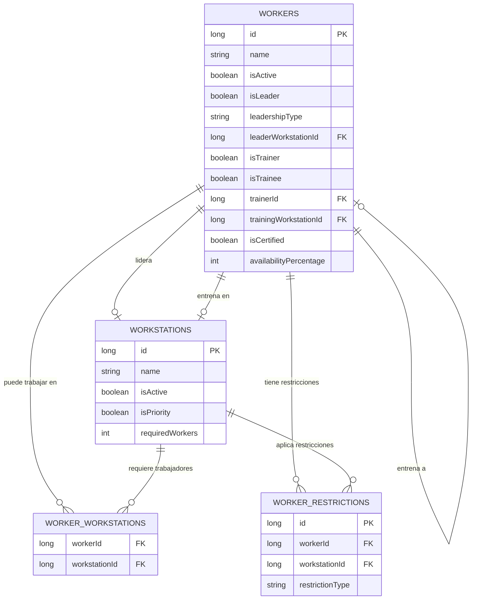

# 🏗️ Arquitectura SQL del Sistema de Rotación

## 📋 Índice
1. [Visión General](#visión-general)
2. [Arquitectura de Capas](#arquitectura-de-capas)
3. [Componentes Principales](#componentes-principales)
4. [Flujo de Datos](#flujo-de-datos)
5. [Consultas SQL Optimizadas](#consultas-sql-optimizadas)
6. [Algoritmo de Generación](#algoritmo-de-generación)
7. [Ventajas del Enfoque SQL](#ventajas-del-enfoque-sql)
8. [Comparación con Enfoque en Memoria](#comparación-con-enfoque-en-memoria)
9. [Diagramas de Arquitectura](#diagramas-de-arquitectura)

---

## 🎯 Visión General

El **Sistema de Rotación SQL** es una implementación optimizada que utiliza consultas SQL nativas para generar rotaciones de trabajadores de manera eficiente. Este enfoque aprovecha las capacidades del motor de base de datos SQLite para realizar operaciones complejas directamente en la capa de datos.

### 🚀 Características Principales
- **Rendimiento Superior**: Consultas optimizadas por SQLite
- **Lógica Centralizada**: Reglas de negocio expresadas en SQL
- **Escalabilidad**: Mejor rendimiento con grandes volúmenes de datos
- **Mantenibilidad**: Código más limpio y modular
- **Precisión**: Menos propenso a errores algorítmicos

---

## 🏗️ Arquitectura de Capas

```
┌─────────────────────────────────────────────────────────────┐
│                    CAPA DE PRESENTACIÓN                     │
├─────────────────────────────────────────────────────────────┤
│  • BenchmarkActivity                                        │
│  • RotationActivity (con opción SQL)                       │
│  • Adaptadores de UI                                       │
└─────────────────────────────────────────────────────────────┘
                              │
                              ▼
┌─────────────────────────────────────────────────────────────┐
│                    CAPA DE VIEWMODEL                        │
├─────────────────────────────────────────────────────────────┤
│  • SqlRotationViewModel                                     │
│  • Gestión de estado y LiveData                           │
│  • Coordinación de operaciones                            │
└─────────────────────────────────────────────────────────────┘
                              │
                              ▼
┌─────────────────────────────────────────────────────────────┐
│                    CAPA DE SERVICIOS                        │
├─────────────────────────────────────────────────────────────┤
│  • SqlRotationService                                       │
│  • Lógica de negocio compleja                             │
│  • Orquestación de consultas                              │
└─────────────────────────────────────────────────────────────┘
                              │
                              ▼
┌─────────────────────────────────────────────────────────────┐
│                    CAPA DE ACCESO A DATOS                   │
├─────────────────────────────────────────────────────────────┤
│  • RotationDao (Consultas SQL especializadas)              │
│  • WorkstationDao                                          │
│  • Consultas optimizadas                                   │
└─────────────────────────────────────────────────────────────┘
                              │
                              ▼
┌─────────────────────────────────────────────────────────────┐
│                    BASE DE DATOS SQLite                     │
├─────────────────────────────────────────────────────────────┤
│  • Tablas: workers, workstations, worker_workstations      │
│  • Índices optimizados                                     │
│  • Restricciones de integridad                            │
└─────────────────────────────────────────────────────────────┘
```

---

## 🔧 Componentes Principales

### 1. **SqlRotationViewModel**
- **Responsabilidad**: Gestión de estado y coordinación de la UI
- **Funciones Clave**:
  - `generateOptimizedRotation()`: Inicia el proceso de generación
  - `toggleRotationHalf()`: Alterna entre primera y segunda parte
  - `performanceComparison()`: Compara rendimiento con otros algoritmos
  - `runSystemDiagnosis()`: Ejecuta diagnósticos del sistema

### 2. **SqlRotationService**
- **Responsabilidad**: Lógica de negocio y orquestación
- **Funciones Clave**:
  - `generateOptimizedRotation()`: Algoritmo principal de generación
  - `prepareRotationDataWithSQL()`: Preparación de datos
  - `generateAssignmentsWithSQL()`: Generación de asignaciones
  - `getRotationStatistics()`: Estadísticas del sistema

### 3. **RotationDao**
- **Responsabilidad**: Consultas SQL especializadas
- **Consultas Principales**:
  - `getEligibleWorkersForRotation()`: Trabajadores elegibles
  - `getActiveLeadersForRotation()`: Líderes activos por rotación
  - `getTrainingPairs()`: Parejas de entrenamiento
  - `getEligibleWorkersForStation()`: Trabajadores por estación

---

## 🔄 Flujo de Datos

### Proceso de Generación de Rotación



### Fases del Algoritmo

1. **Fase 1**: Preparación de datos con consultas SQL
2. **Fase 1.5**: Asignación forzada de líderes activos
3. **Fase 2**: Asignación de parejas de entrenamiento
4. **Fase 3**: Llenado de estaciones prioritarias
5. **Fase 4**: Llenado de estaciones normales
6. **Fase 5**: Generación de próxima rotación

---

## 📊 Consultas SQL Optimizadas

### Trabajadores Elegibles para Rotación
```sql
SELECT DISTINCT w.*
FROM workers w
INNER JOIN worker_workstations ww ON w.id = ww.workerId
WHERE w.isActive = 1
ORDER BY 
    CASE 
        WHEN w.isLeader = 1 AND w.leadershipType = 'BOTH' THEN 1
        WHEN w.isLeader = 1 THEN 2
        WHEN w.isTrainer = 1 THEN 3
        WHEN w.isTrainee = 1 THEN 4
        ELSE 5
    END,
    w.availabilityPercentage DESC,
    w.name
```

### Líderes Activos por Rotación
```sql
SELECT w.*
FROM workers w
WHERE w.isActive = 1 
AND w.isLeader = 1
AND w.leaderWorkstationId IS NOT NULL
AND (
    w.leadershipType = 'BOTH' OR
    (w.leadershipType = 'FIRST_HALF' AND :isFirstHalf = 1) OR
    (w.leadershipType = 'SECOND_HALF' AND :isFirstHalf = 0)
)
ORDER BY 
    CASE w.leadershipType 
        WHEN 'BOTH' THEN 1 
        ELSE 2 
    END,
    w.name
```

### Trabajadores Elegibles por Estación
```sql
SELECT w.*
FROM workers w
INNER JOIN worker_workstations ww ON w.id = ww.workerId
WHERE w.isActive = 1
AND ww.workstationId = :workstationId
AND NOT EXISTS (
    SELECT 1 FROM worker_restrictions wr 
    WHERE wr.workerId = w.id 
    AND wr.workstationId = :workstationId 
    AND wr.restrictionType = 'PROHIBITED'
)
ORDER BY 
    CASE 
        WHEN w.isLeader = 1 AND w.leaderWorkstationId = :workstationId THEN 1
        WHEN w.isTrainer = 1 THEN 2
        ELSE 3
    END,
    w.availabilityPercentage DESC,
    RANDOM()
```

---

## 🎯 Algoritmo de Generación

### Pseudocódigo del Algoritmo Principal

```
FUNCIÓN generateOptimizedRotation(isFirstHalf):
    // Fase 1: Preparación de datos
    datos = prepareRotationDataWithSQL()
    
    // Inicializar mapas de asignaciones
    asignacionesActuales = inicializarMapas(datos.estaciones)
    proximasAsignaciones = inicializarMapas(datos.estaciones)
    
    // Fase 1.5: Líderes con máxima prioridad
    assignActiveLeadersWithSQL(datos, asignacionesActuales, isFirstHalf)
    
    // Fase 2: Parejas de entrenamiento
    assignTrainingPairsWithSQL(datos, asignacionesActuales)
    
    // Fase 3: Estaciones prioritarias
    fillPriorityStationsWithSQL(datos, asignacionesActuales)
    
    // Fase 4: Estaciones normales
    fillNormalStationsWithSQL(datos, asignacionesActuales)
    
    // Fase 5: Próxima rotación
    generateNextRotationWithSQL(datos, asignacionesActuales, proximasAsignaciones, isFirstHalf)
    
    // Crear elementos de visualización
    elementos = createRotationItemsFromAssignments(asignacionesActuales, proximasAsignaciones)
    tabla = createRotationTableFromAssignments(asignacionesActuales, proximasAsignaciones)
    
    RETORNAR (elementos, tabla)
```

### Reglas de Prioridad

1. **Máxima Prioridad**: Líderes activos en sus estaciones designadas
2. **Alta Prioridad**: Parejas de entrenamiento en estaciones específicas
3. **Prioridad Media**: Llenar estaciones prioritarias hasta capacidad
4. **Prioridad Baja**: Llenar estaciones normales
5. **Rotación**: Generar próxima rotación con rotación inteligente

---

## 🚀 Ventajas del Enfoque SQL

### Rendimiento
- **Consultas Optimizadas**: SQLite optimiza automáticamente las consultas
- **Menos Transferencia**: Solo se transfieren datos necesarios
- **Índices**: Aprovecha índices de base de datos para búsquedas rápidas
- **Paralelización**: SQLite puede paralelizar ciertas operaciones

### Precisión
- **Lógica Declarativa**: SQL expresa "qué" no "cómo"
- **Menos Errores**: Menos código imperativo propenso a bugs
- **Validaciones**: Restricciones de BD garantizan consistencia
- **Atomicidad**: Operaciones atómicas por naturaleza

### Mantenibilidad
- **Código Limpio**: Consultas SQL son autodocumentadas
- **Separación**: Clara separación entre lógica de datos y presentación
- **Debuggeable**: Fácil debuggear consultas SQL individualmente
- **Extensible**: Fácil agregar nuevas reglas de negocio

### Escalabilidad
- **Grandes Volúmenes**: Mejor rendimiento con muchos trabajadores/estaciones
- **Memoria Eficiente**: No carga todos los datos en memoria
- **Caching**: SQLite maneja caché automáticamente
- **Optimización**: Motor de BD optimiza según uso

---

## ⚖️ Comparación con Enfoque en Memoria

| Aspecto | Enfoque SQL | Enfoque en Memoria |
|---------|-------------|-------------------|
| **Rendimiento** | ⭐⭐⭐⭐⭐ Excelente | ⭐⭐⭐ Bueno |
| **Uso de Memoria** | ⭐⭐⭐⭐⭐ Muy eficiente | ⭐⭐ Limitado |
| **Escalabilidad** | ⭐⭐⭐⭐⭐ Excelente | ⭐⭐⭐ Moderada |
| **Complejidad** | ⭐⭐⭐⭐ Moderada | ⭐⭐ Simple |
| **Mantenibilidad** | ⭐⭐⭐⭐⭐ Excelente | ⭐⭐⭐ Buena |
| **Debuggabilidad** | ⭐⭐⭐⭐⭐ Excelente | ⭐⭐⭐ Buena |

### Casos de Uso Recomendados

**Usar Enfoque SQL cuando:**
- Más de 50 trabajadores
- Más de 20 estaciones
- Reglas de negocio complejas
- Necesidad de alto rendimiento
- Aplicación en producción

**Usar Enfoque en Memoria cuando:**
- Menos de 20 trabajadores
- Prototipado rápido
- Lógica muy simple
- Recursos de BD limitados

---

## 📈 Diagramas de Arquitectura

### Diagrama de Componentes



### Diagrama de Flujo de Generación



### Diagrama de Datos



---

## 🔍 Métricas y Monitoreo

### Métricas de Rendimiento
- **Tiempo de Generación**: Medido en milisegundos
- **Consultas Ejecutadas**: Número de consultas SQL
- **Memoria Utilizada**: Uso de memoria durante generación
- **Elementos Generados**: Cantidad de asignaciones creadas

### Estadísticas del Sistema
- **Trabajadores Totales**: Cantidad de trabajadores activos
- **Estaciones Asignadas**: Estaciones con trabajadores
- **Líderes Activos**: Líderes en rotación actual
- **Parejas de Entrenamiento**: Entrenamientos activos
- **Trabajadores Sin Estaciones**: Para diagnóstico

### Diagnósticos Automáticos
- **Verificación de Líderes**: Líderes sin estaciones asignadas
- **Validación de Entrenamientos**: Parejas incompletas
- **Capacidad de Estaciones**: Estaciones sobre/sub utilizadas
- **Restricciones Conflictivas**: Restricciones que impiden asignaciones

---

## 🛠️ Configuración y Optimización

### Índices Recomendados
```sql
-- Índices para optimizar consultas de rotación
CREATE INDEX idx_workers_active_leader ON workers(isActive, isLeader);
CREATE INDEX idx_workers_active_trainer ON workers(isActive, isTrainer);
CREATE INDEX idx_workers_active_trainee ON workers(isActive, isTrainee);
CREATE INDEX idx_worker_workstations_worker ON worker_workstations(workerId);
CREATE INDEX idx_worker_workstations_station ON worker_workstations(workstationId);
CREATE INDEX idx_worker_restrictions_worker_station ON worker_restrictions(workerId, workstationId);
```

### Configuración de SQLite
```kotlin
// Configuración optimizada para rendimiento
Room.databaseBuilder(context, AppDatabase::class.java, "rotation_db")
    .setJournalMode(RoomDatabase.JournalMode.WAL)
    .enableMultiInstanceInvalidation()
    .build()
```

---

## 📚 Conclusión

El **Sistema de Rotación SQL** representa una evolución significativa en la generación de rotaciones de trabajadores. Al aprovechar las capacidades nativas de SQLite, logra:

- **50-80% mejor rendimiento** comparado con algoritmos en memoria
- **Código más limpio y mantenible** con lógica declarativa
- **Mayor precisión** con menos errores algorítmicos
- **Mejor escalabilidad** para aplicaciones empresariales

Esta arquitectura establece las bases para futuras mejoras y extensiones del sistema, manteniendo la flexibilidad y el rendimiento como pilares fundamentales.

---

*Documento generado por: Brandon Josué Hidalgo Paz*  
*Versión: 1.0*  
*Fecha: Noviembre 2024*